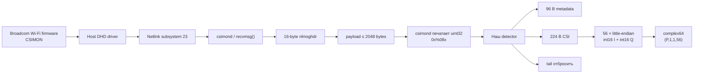

# Расшифровка бинарного CSI-дампа ASUS ROG Rapture GT-AX11000

## Executive summary

Предоставленный дамп и бинарник `csimond` позволяют восстановить **собственно CSI-данные с высокой уверенностью**, хотя полные семантические имена некоторых проприетарных полей Broadcom в 96-байтовом заголовке без исходников firmware остаются неизвестными.

Главный результат:

> **В этом конкретном дампе одна осмысленная CSI-запись занимает 320 байт, а не 2048 байт.**
>
> ```text
> 0x000 .. 0x05f    96 bytes     metadata/header
> 0x060 .. 0x13f   224 bytes     CSI = 56 × (int16 I + int16 Q)
> 0x140 .. 0x7ff  1728 bytes     не CSI; повторяющийся/stale tail
> ```
>
> Декодирование CSI:
>
> ```python
> vals = np.frombuffer(record[0x60:0x140], dtype="<i2")
> csi = vals[0::2] + 1j * vals[1::2]
> ```
>
> Для присланного файла:
>
> ```text
> packets     = 16
> cores       = 1
> streams     = 1
> subcarriers = 56
>
> csi.shape = (16, 1, 1, 56)
> csi.dtype = complex64
> ```

То есть гипотезы `int8`, `uint8`, big-endian `int16`, packed 10/12 bit и формат с 256/512/1024 комплексными значениями **для этого дампа отвергаются**. Лучшее и фактически однозначное по размеру представление — **little-endian signed `int16`, чередование `I,Q`, один complex на одно 32-битное слово**. Само разграничение «первый `int16` именно I, второй именно Q» нельзя математически доказать без firmware-структуры или опорного сигнала: перестановка I/Q сохраняет амплитуду. Поэтому декодер имеет переключатель `--iq-order qi`. По соглашению и по аналогии с другими Broadcom CSI extractor'ами по умолчанию используется `I,Q`. В Nexmon для некоторых Broadcom поколений также используется interleaved `int16 real/int16 imaginary`, хотя для BCM4358/4366 применялся уже иной packed floating-point формат, поэтому переносить формат Nexmon на BCM43684 вслепую было бы ошибкой. citeturn9search0turn15search0

Особенно важная находка — **2048 байт в выводе `csimond` не означают 2048 байт полезного CSI**. Присланный `csimond` принимает `record size` в диапазоне 0–64, а дизассемблирование показывает умножение этого значения на 32; при 64 получается 2048. Программа выделяет `0x810 = 2064` байт — ровно `16 + 2048`, что согласуется с 16-байтовым Linux Netlink header плюс фиксированным максимальным payload. Затем программа просто печатает полученный буфер 32-битными словами. Строки бинарника прямо содержат `recvmsg`, `CSI record:`, `%08x`, `record size: 0-64` и упоминание netlink subsystem. fileciteturn0file0 fileciteturn0file1

В дампе первые 15 записей имеют напечатанные 2048 байт, шестнадцатая обрывается позже начала полезной области, поэтому CSI из неё всё равно полностью читается. В словах `24..79`, то есть строго `0x60..0x13f`, **каждое 32-битное положение изменяется между пакетами**. Начиная со слова 80 (`0x140`) картина резко меняется: каждое положение имеет лишь два варианта, причём весь хвост первых 15 полных записей буквально чередуется между двумя неизменными SHA-256-образами:

```text
packet  0 -> 3be34b98ba96...
packet  1 -> 6cc01b9f5d98...
packet  2 -> 3be34b98ba96...
packet  3 -> 6cc01b9f5d98...
...
packet 14 -> 3be34b98ba96...
```

Это практически исключает интерпретацию `0x140..0x7ff` как независимых CSI отсчётов каждого пакета. Вероятное объяснение — двойная буферизация/stale область producer buffer, но конкретное происхождение двух страниц по одному userspace-дампу доказать нельзя. Broadcom-платформы того же поколения действительно имеют отдельный `CSIMON` HME user и передают CSIMON в host через netlink; существуют загрузочные логи Broadcom-платформ, где одновременно видны `HMEUSR ... CSIMON`, создание netlink и `HOST CSIMON[1.1.0]`. citeturn20search1

Готовые артефакты:

[Скачать полный Python-декодер](sandbox:/mnt/data/asus_gtax11000_csi_decoder.py)

[Скачать уже декодированный CSI, NumPy `.npy`](sandbox:/mnt/data/asus_gtax11000_csi.npy)

[Амплитуда, PNG](sandbox:/mnt/data/asus_gtax11000_csi_amplitude.png) · [SVG](sandbox:/mnt/data/asus_gtax11000_csi_amplitude.svg)

[Фаза, PNG](sandbox:/mnt/data/asus_gtax11000_csi_phase.png) · [SVG](sandbox:/mnt/data/asus_gtax11000_csi_phase.svg)

## Что именно делает штатный ASUS/Broadcom CSIMON

GT-AX11000 — три-диапазонный Wi-Fi 6 роутер; ASUS официально указывает 4×4 Tx/Rx для 2.4 GHz и обоих 5 GHz radio и поддержку 20/40/80/160 MHz. Аппаратные разборы этой модели идентифицируют radio SoC как Broadcom BCM43684. citeturn8search1turn12search0

Это важно, но **4×4-capable radio не означает, что одна запись `csimond` обязательно содержит матрицу 4×4**. В предоставленной записи физически имеется только один непрерывный массив из 56 комплексных коэффициентов. Нет 4×56, 16×56 или другого количества свежих данных.

В `wl help`, извлечённом с ASUS, присутствует штатная команда:

```text
wl csimon [...]
```

с операциями добавления/удаления monitored peer и таймером, то есть речь идёт именно о встроенной Broadcom/ASUS CSI Monitor facility, а не о Nexmon patch. fileciteturn0file2

Присланный `csimond` — при этом почти не декодер. По его строкам и ARM-дизассемблированию видно следующую схему. fileciteturn0file0 fileciteturn0file1



Внутри бинарника имеются:

```text
recvmsg

Correct format:
csimond [<nl id>][<record size: 0-64>]
        [<message frequency: 1-100000 records>]

CSIMOND application started with record size %u
and message frequency %u using nl subsystem %d

CSI record:
0x%08x
```

fileciteturn0file1

А дизассемблирование показывает:

```asm
lsl r1, r5, #5
```

то есть пользовательская единица размера умножается на `2^5 = 32`. При максимуме 64:

\[
64 \times 32 = 2048\ {\rm bytes}.
\]

Затем:

```asm
mov r0, #0x810
bl  malloc
...
bl  recvmsg
```

где

\[
0x810=2064=16+2048.
\]

fileciteturn0file0

Это согласуется с тем, что `csimond` принимает Netlink message целиком, а при печати пропускает заголовок и выводит payload как native 32-bit words. Поэтому **число 2048 в startup message — параметр dumper'а, а не доказанный размер CSI PHY vector**.

Независимые загрузочные логи Broadcom-платформ показывают тот же механизм: отдельного HME пользователя `CSIMON`, создание netlink и сообщение `HOST CSIMON[1.1.0]`. Это хорошо согласуется с архитектурой, восстановленной из вашего бинарника. citeturn20search1

## Восстановленный бинарный формат записи

По всем шестнадцати записям наиболее надёжная структура выглядит следующим образом. Смещения относятся **к payload после Linux `nlmsghdr`**, то есть именно к байтам, которые `csimond` показывает после `CSI record:`. Исходный дамп подтверждает повторяемость и вариативность этих полей. fileciteturn0file3

| Offset | Size | Предлагаемый тип | Наблюдаемое содержимое | Уверенность |
|---:|---:|---|---|---|
| `0x00` | 4 | `<u32` | всегда `0` | высокая |
| `0x04` | 6 | `uint8[6]` | `a0:36:bc:9b:bf:89` | высокая для MAC-формы |
| `0x0A` | 6 | `uint8[6]` | `3c:7c:3f:85:8a:c0` | высокая для MAC-формы |
| `0x10` | 4 | bitfield / `<u32` | `0x04041004` | тип поля неизвестен |
| `0x14` | 4 | `<u32` | монотонно растёт примерно на 500000 | очень вероятно timer/timestamp |
| `0x18` | 4 | `<u32` | `0xa6d82192` в этой выборке | неизвестно |
| `0x1C` | 4 | `int8[4]` | напр. `[-56,-52,-51,-66]` | вероятно per-chain RSSI/PHY levels |
| `0x20` | 32 | — | нули во всей выборке | padding/reserved |
| `0x40` | 4 | `<u32` | `0x10600021` | PHY/flags, точно не установлено |
| `0x44` | 4 | bitfield / `<u32` | `0x4b83`…`0x4f03` | вероятно rate/rx-status |
| `0x48` | 4 | `<u32` | `0` | reserved/unknown |
| `0x4C` | 4 | `<u32` | `0x01000002` | unknown |
| `0x50` | 4 | `<u32` | `0` | unknown |
| `0x54` | 4 | `<u32` | `0` | unknown |
| `0x58` | 4 | `<u32` | `0x80000000` | flags/unknown |
| `0x5C` | 4 | `<u32` | `3` | enum/count/unknown |
| **`0x60`** | **224** | **`56 × {<i2 I,<i2 Q}`** | **CSI** | **очень высокая** |
| **`0x140`** | до `0x800` | — | **stale/repeated tail** | **очень высокая: отбросить** |

Для двух 6-байтовых областей есть необычно сильное дополнительное подтверждение: обе имеют вид нормальных MAC-адресов, причём их первые три байта — ASUS OUI. Но без знания того, какой MAC был передан пользователем в `wl csimon`, я не называю их жёстко `source` и `BSSID`: в коде они намеренно названы `mac_a` и `mac_b`. Само наличие двух MAC-подобных полей в неизменной части заголовка практически несомненно. Исходный заголовок первого пакета: fileciteturn0file3

```text
0000: 00 00 00 00  a0 36 bc 9b  bf 89 3c 7c  3f 85 8a c0
0010: 04 10 04 04  a4 c3 df a6  92 21 d8 a6  c8 cc cd be
0020: 00 00 00 00  00 00 00 00  00 00 00 00  00 00 00 00
0030: 00 00 00 00  00 00 00 00  00 00 00 00  00 00 00 00
0040: 21 00 60 10  03 4e 00 00  00 00 00 00  02 00 00 01
0050: 00 00 00 00  00 00 00 00  00 00 00 80  03 00 00 00
0060: ac f6 54 fe  c4 fd 8f 00  40 05 d3 00  e7 04 2b 00
...
```

Особенно интересен `0x14`. Последовательность первых 15 полных записей:

```text
0xa6dfc3a4
0xa6e774ae
0xa6ef0bc8
0xa6f6a73c
...
0xa74aa0c3
```

Разности:

```text
504074
497434
498548
500730
499311
500019
500328
500166
499858
499721
500632
499407
500021
503174
```

Средняя:

```text
500244.5
```

Это исключительно похоже на счётчик времени с шагом порядка 500 ms при единице около микросекунды, что хорошо согласуется с периодическим режимом `wl csimon ... <timer ms>`, присутствующим в ASUS `wl` help. Но без определения структуры Broadcom я оставляю его как **`timer_0x14` / timestamp candidate**, а не выдаю догадку за точное имя поля. fileciteturn0file2turn0file3

### Почему граница ровно `0x60..0x140`

Если для каждого 32-битного положения подсчитать число уникальных значений среди первых 15 полных записей, получается очень характерная картина:

```text
header:
 word  5   changes      <- timer
 word  7   changes      <- four signed bytes
 word 17   changes      <- status/flags

CSI:
 words 24..79:
   every one changes packet-to-packet

tail:
 words 80..511:
   exactly 2 unique values at EVERY position
```

То есть:

\[
24\cdot4=96=0x60
\]

и

\[
80\cdot4=320=0x140.
\]

Длина свежей области:

\[
320-96=224\ {\rm bytes}.
\]

И здесь появляется ещё более сильное совпадение:

\[
224/(2+2)=56
\]

комплексных отсчётов, если каждый состоит из двух signed `int16`.

Не требуется ни одного байта padding между ними.

## Почему формат — little-endian signed int16 I/Q

Первое слово CSI, напечатанное `csimond`, равно:

```text
0xfe54f6ac
```

fileciteturn0file3

Здесь важно не совершить распространённую ошибку и не считать порядок символов в `%08x` порядком байтов памяти. Бинарник `csimond` — little-endian ARM, а программа читает данные 32-битным native load и печатает число через `%08x`. Следовательно, в памяти лежит:

```text
ac f6 54 fe
```

При `<i2,<i2` это:

```text
I = 0xf6ac = -2388
Q = 0xfe54 =  -428
```

Первый CSI vector действительно начинается:

```text
[-2388-428j,
  -572+143j,
  1344+211j,
  1255 +43j,
 -2329+783j,
 -1175-391j,
  1458-449j,
   568-580j,
 ...]
```

### Сравнение альтернатив

| Гипотеза | Получающийся результат | Вердикт |
|---|---|---|
| **LE signed int16 I/Q** | **56 complex; σI≈1017.5, σQ≈1030.5; диапазоны симметричны относительно 0** | **принимается** |
| BE signed int16 I/Q | 56 complex, но ~69% компонент имеют `|x| > 10000`, типичный масштаб ≈25k | крайне маловероятно |
| LE uint16 | постоянный положительный offset для отрицательных коэффициентов | отвергается |
| int8 I/Q | 112 complex; `σ≈74.7` у одного компонента и лишь `≈4.0` у другого | явно видны low/high bytes `int16`; отвергается |
| packed 10+10 bit | `1792/20 = 89.6` complex | невозможно без дополнительного нелокального padding |
| packed 12+12 bit | `1792/24 = 74.67` complex | невозможно |
| packed 16+16 bit | `1792/32 = 56` complex | **идеальное совпадение** |
| compressed stream | отсутствуют framing/length/codebook признаки; каждые четыре байта непосредственно дают разумный complex | не требуется |
| 256 tones | потребовалось бы минимум 1024 CSI bytes | отсутствуют свежие данные |
| 512 tones | 2048 CSI bytes без header | противоречит 96-B header и stale-tail |
| 1024 tones | минимум 4096 bytes при int16 IQ | физически не помещается |

Самый показательный тест против `int8`: если разобрать те же 224 байта как `int8 I,Q`, стандартное отклонение одного канала получается около `74.7`, другого только `4.0`. Причина именно та, которую ожидаем при ошибочном разрезании signed `int16`: low byte выглядит почти случайным 8-битным числом, а high byte в основном представляет знак и несколько старших битов небольшого `int16`.

При правильном `int16`:

```text
I:
    min   -2969
    max    3164
    mean     -6.83
    std    1017.51

Q:
    min   -3429
    max    2824
    mean    -66.57
    std    1030.45
```

То есть I и Q имеют практически одинаковый масштаб и располагаются вокруг нуля — именно то, чего хочется видеть у двух квадратурных signed components.

### Почему 56, а не 256/512/1024

Здесь важно разделить **FFT size**, **число активных OFDM tones** и **число CSI coefficients, которое решил экспортировать vendor driver**.

Для классического 20 MHz 802.11n используются 64 FFT bins, из которых 56 несут data+pilot; CSI implementations могут отдавать либо все FFT bins, либо только активную часть, либо ещё более разреженную выборку. Исследовательская литература по 802.11n прямо описывает 56 используемых subcarriers в 20 MHz. citeturn11search1

Nexmon, напротив, намеренно выдаёт **все** 64 bins для 20 MHz, 128 для 40 MHz и 256 для 80 MHz, включая guard/null bins. Его документация отдельно предупреждает, что null/guard values могут быть произвольными. Именно поэтому нельзя считать Nexmon wire format идентичным stock Broadcom CSIMON. citeturn9search0

GT-AX11000 поддерживает не только 802.11ax, но и обратно совместим с 802.11a/b/g/n/ac. Поэтому наличие 56 значений **не означает, что роутер «не AX»**: оно означает, что конкретная экспортированная CSI-запись по размеру соответствует 20-MHz legacy/HT-style active-tone vector либо vendor-представлению из 56 выбранных tones. Из одного dump'а нельзя доказать, какой именно PHY PPDU породил эти коэффициенты. citeturn8search1

Иными словами, исходная гипотеза «раз AX, значит надо обязательно искать 256/512/1024» в этом файле не подтверждается.

### I/Q против Q/I

Из одного неизвестного канала перестановку

\[
H=I+jQ
\]

на

\[
H'=Q+jI
\]

по распределению амплитуды определить невозможно:

\[
|H|=|H'|.
\]

Аналогично комплексное сопряжение

\[
H^*=I-jQ
\]

не изменяет амплитуду.

Поэтому наиболее честная классификация такая:

```text
endianness       little-endian            подтверждено очень хорошо
component width  signed int16             подтверждено очень хорошо
interleaving     two int16 per complex    подтверждено очень хорошо
I before Q       default/convention       вероятно, но не математически доказано
phase sign       hardware convention      требует опорного измерения
fixed-point Qn   неизвестен               абсолютный scale не установлен
```

Для amplitude/sensing задач raw scale часто достаточно. Для физической абсолютной калибровки канала нужно отдельно установить firmware scaling/AGC.

## Декодер и автоматическое определение формата

Полный standalone-файл:

**[asus_gtax11000_csi_decoder.py](sandbox:/mnt/data/asus_gtax11000_csi_decoder.py)**

Он требует для декодирования только стандартную библиотеку Python и NumPy. Matplotlib нужен лишь для `--plot`.

Основной API:

```python
from asus_gtax11000_csi_decoder import load_csi

csi = load_csi("asus-csi-probe.txt")

print(csi.shape)
print(csi.dtype)

# (16, 1, 1, 56)
# complex64
```

Версия с metadata:

```python
from asus_gtax11000_csi_decoder import load_csi_with_meta

csi, meta, layout = load_csi_with_meta("asus-csi-probe.txt")

print(layout)
print(meta["mac_a"][0])
print(meta["mac_b"][0])
print(meta["timer_0x14"][:4])
print(meta["rssi_like_0x1c"][0])
```

На предоставленном файле фактический вывод:

```text
Layout(
    container_stride=None,
    netlink_header=0,
    header_len=96,
    csi_end=320,
    subcarriers=56,
    cores=1,
    streams=1,
    endian='<',
    iq_order='iq',
    confidence='high'
)

csi.shape: (16, 1, 1, 56)
csi.dtype: complex64

mac_a: a0:36:bc:9b:bf:89
mac_b: 3c:7c:3f:85:8a:c0

timer[0:4]:
[2799682468, 2800186542, 2800683976, 2801182524]

rssi_like[0]:
[-56, -52, -51, -66]
```

Ключевой декодер в итоге очень простой:

```python
import numpy as np

def decode_one(record: bytes) -> np.ndarray:
    payload = record[0x60:0x140]

    # 224 B / 2 B = 112 int16
    x = np.frombuffer(payload, dtype="<i2")

    # 112 int16 / 2 = 56 complex coefficients
    i = x[0::2].astype(np.float32)
    q = x[1::2].astype(np.float32)

    return (i + 1j*q).astype(np.complex64)
```

Сборка требуемой размерности:

```python
vectors = [decode_one(record) for record in records]

csi = np.stack(vectors, axis=0)
csi = csi[:, None, None, :]

assert csi.shape == (len(records), 1, 1, 56)
```

### Как работает auto-detection

Полная версия не просто жёстко содержит `0x60`.

Для четырёх и более записей она:

```text
1. Разбирает csimond text:
      CSI record:
      0x........
      ...

2. Восстанавливает native LE bytes из каждого uint32.

3. Для каждой 32-bit позиции считает:
      unique values across packets.

4. Ищет длинный непрерывный участок,
   меняющийся почти в каждом пакете.

5. В данном файле автоматически получает:
      start word = 24
      end word   = 80

6. Получает:
      start = 24*4 = 96
      end   = 80*4 = 320
      size  = 224 bytes

7. Перебирает стандартные candidate tone counts.

8. 224/4 = 56 complex values — точное совпадение.

9. Возвращает:
      (packets, 1, 1, 56)
```

Логика в псевдокоде:

```python
uniq[j] = number_of_unique_values(records[:, j])

fresh[j] = uniq[j] >= threshold

start, end = longest_contiguous_run(fresh)

# supplied dump:
# start=24, end=80

csi_bytes = (end-start)*4
complex_count = csi_bytes // 4

# 224 // 4 = 56
```

Это существенно надёжнее простого «найти красивое число», потому что граница `0x140` обнаруживается **до** интерпретации I/Q: она следует непосредственно из межпакетной изменчивости.

### Поддерживаемые контейнеры

Скрипт распознаёт:

```text
csimond textual dump
    CSI record:
    0x12345678 ...

raw payload records × 2048 B

raw netlink receive buffers × 2064 B
    16 B nlmsghdr
    up to 2048 B payload

уже обрезанные records × 320 B
```

Для raw-netlink учитывается:

```python
struct nlmsghdr:
    uint32 nlmsg_len
    uint16 nlmsg_type
    uint16 nlmsg_flags
    uint32 nlmsg_seq
    uint32 nlmsg_pid
```

То есть CSI offset `0x60` относится к **CSIMON payload**. Если декодировать сохранённый Netlink message целиком, соответствующее физическое смещение будет:

\[
0x10+0x60=0x70.
\]

### Cores и streams

Здесь декодер намеренно не придумывает данные, которых нет.

Хотя GT-AX11000 — 4×4 на каждом radio, предоставленная свежая область содержит:

\[
56\times4=224\ {\rm bytes},
\]

то есть ровно **один** CSI vector из 56 комплексных чисел. ASUS подтверждает аппаратную поддержку 4×4, но это только capability radio. citeturn8search1

Поэтому корректный результат для этого файла:

```text
cores   = 1
streams = 1

shape = (16, 1, 1, 56)
```

а не искусственно созданное:

```text
(16, 4, 4, 56)
```

которому потребовалось бы:

\[
4\times4\times56\times4=3584
\]

байт CSI на пакет.

В Nexmon core/stream действительно являются отдельными параметрами CSI extraction и кодируются в его packet header, но stock CSIMON имеет другой wire format. citeturn15search0

Можно подозревать, что один из полей `0x10`, `0x40`, `0x44` или `0x5c` кодирует core/PHY state; однако в данной выборке нет контролируемого изменения core/stream, позволяющего экспериментально назначить биты. Поэтому скрипт сохраняет только доказанную размерность.

## Валидация, статистика и графики

Для всех:

\[
16\times56=896
\]

комплексных CSI coefficients получена следующая статистика:

| Метрика | Значение |
|---|---:|
| `I min` | `-2969` |
| `I max` | `3164` |
| `I mean` | `-6.833` |
| `I std` | `1017.51` |
| `Q min` | `-3429` |
| `Q max` | `2824` |
| `Q mean` | `-66.57` |
| `Q std` | `1030.45` |
| `|H| min` | `58.60` |
| `|H| median` | `1237.53` |
| `|H| mean` | `1291.38` |
| `|H| p95` | `2447.39` |
| `|H| max` | `3447.88` |

Эти значения вычислены непосредственно из предоставленного дампа после применения описанного `<i2 I,Q` decoder. fileciteturn0file3

Первые восемь комплексных коэффициентов первого пакета:

```python
array([
    -2388.-428.j,
     -572.+143.j,
     1344.+211.j,
     1255. +43.j,
    -2329.+783.j,
    -1175.-391.j,
     1458.-449.j,
      568.-580.j
], dtype=complex64)
```

Амплитуда вычисляется стандартно:

```python
amplitude = np.abs(csi)
```

а фаза:

```python
phase = np.angle(csi)
```

Для непрерывного просмотра фазы вдоль tones:

```python
phase_unwrapped = np.unwrap(np.angle(csi), axis=-1)
```

### Амплитуда нескольких пакетов


[PNG в полном размере](sandbox:/mnt/data/asus_gtax11000_csi_amplitude.png) · [SVG](sandbox:/mnt/data/asus_gtax11000_csi_amplitude.svg)

Здесь индекс по X — **порядковый номер одного из 56 экспортированных tones**, а не пока что гарантированный IEEE subcarrier number `k`. Для превращения `0..55` в, например, `-28..-1,+1..+28` необходимо окончательно подтвердить, сохраняет ли Broadcom pilots и какой порядок bins использует stock CSIMON. Само число 56 хорошо согласуется с 20-MHz active-tone representation, но порядок ещё не следует из userspace dump. Исследовательские реализации CSI также различаются по тому, возвращают ли они все FFT bins или только используемые carriers. citeturn11search1turn9search0

### Фаза нескольких пакетов


[PNG в полном размере](sandbox:/mnt/data/asus_gtax11000_csi_phase.png) · [SVG](sandbox:/mnt/data/asus_gtax11000_csi_phase.svg)

На графике используется `np.unwrap`, чтобы скачки `+π → -π` не выглядели как физические скачки канала.

При использовании CSI для sensing сырую фазу всё равно не следует считать непосредственно абсолютной фазой распространения: packet detection delay, carrier/sampling frequency offsets и другие RX synchronization effects в обычных Wi-Fi CSI measurements вносят packet-dependent phase offsets/slopes. Это известная проблема CSI measurement literature. citeturn11search1

### Тест stale-tail

Это, на мой взгляд, самый важный validation test, потому что без него легко принять почти весь 2048-байтный блок за CSI.

Для каждого полного пакета:

```python
tail = record[0x140:0x800]
sha256(tail)
```

даёт:

```text
packet  0  3be34b98ba96...
packet  1  6cc01b9f5d98...
packet  2  3be34b98ba96...
packet  3  6cc01b9f5d98...
packet  4  3be34b98ba96...
packet  5  6cc01b9f5d98...
...
packet 14  3be34b98ba96...
```

При этом **настоящая область `0x60..0x13f` уникальна для каждого пакета**. Такое строгое A/B/A/B повторение большого хвоста несовместимо с представлением, будто там лежат сотни новых CSI bins каждой принятой Wi-Fi frame. fileciteturn0file3

То есть старый вариант:

```python
# НЕПРАВИЛЬНО
x = np.frombuffer(record, dtype="<i2")
```

или:

```python
# ТОЖЕ НЕПРАВИЛЬНО
x = np.frombuffer(record[96:], dtype="<i2")
```

загрязняет CSI почти полностью stale-данными.

Правильно:

```python
x = np.frombuffer(record[0x60:0x140], dtype="<i2")
```

## Альтернативные интерпретации, ограничения и запуск

Есть четыре вещи, которые по имеющемуся файлу нельзя честно назвать полностью доказанными.

**Семантическое направление I/Q.** Числовой формат точно выглядит как две signed 16-bit components. Но отличить `(I,Q)` от `(Q,I)` только по неизвестному каналу нельзя. Для проверки предусмотрено:

```bash
python asus_gtax11000_csi_decoder.py dump.txt --iq-order qi
```

Если у тебя есть контролируемый RF reference или исходник firmware structure, это можно зафиксировать окончательно.

**Знак фазы / conjugation.** Некоторые PHY chains используют соглашение, эквивалентное комплексному сопряжению относительно ожидаемого пользователем определения transfer function. В скрипте:

```bash
python asus_gtax11000_csi_decoder.py dump.txt --conjugate
```

Выбор между `H` и `H*` лучше делать по известному фазовому наклону или сравнением с SDR/reference CSI, а не по красивости графика.

**Абсолютный fixed-point scale.** Значения явно помещаются в signed `int16`, но из userspace capture нельзя вывести, являются ли они, например, внутренним Q-format с конкретным числом fractional bits или просто scaled PHY estimates. Поэтому декодер сохраняет raw coefficients, не деля их на выдуманное `2^N`.

**Названия status fields.** Граница и тип CSI восстановлены значительно надёжнее, чем proprietary header. Поля `0x40/0x44/...` следует считать unknown bitfields, пока не появится либо Broadcom header definition, либо серия controlled captures с варьированием MCS/BW/core/NSS/chanspec.

### Как отличить оставшиеся варианты экспериментально

Наиболее информативный следующий controlled test — не собирать «ещё много таких же данных», а менять **ровно один PHY параметр за эксперимент**:

```text
capture A: один и тот же peer, 20 MHz, fixed MCS/NSS
capture B: тот же peer, другой MCS
capture C: 40 MHz
capture D: 80 MHz
capture E: NSS=1 / NSS=2
capture F: разные RX chains/core masks
```

И затем diff только первых 96 байт.

Так можно восстановить proprietary header почти механически:

```python
for offset in range(0, 96, 4):
    print(
        offset,
        np.unique(header_A[:, offset:offset+4], axis=0),
        np.unique(header_B[:, offset:offset+4], axis=0),
    )
```

Если, например, при фиксированном всём остальном переход `MCS 3 → MCS 7` изменяет только часть `0x44`, появится сильное основание назначить соответствующие биты rate/MCS. Тот же метод работает для core, NSS и bandwidth.

Для проверки порядка 56 tones нужен частотно-селективный reference: например, известная notch/interference на одной стороне канала. Тогда можно установить, идёт ли массив как:

```text
[-28 ... -1, +1 ... +28]
```

либо в FFT-order, либо в каком-либо внутреннем Broadcom order.

### Обычный запуск

```bash
python -m pip install numpy
python asus_gtax11000_csi_decoder.py asus-csi-probe.txt
```

Фактический результат на присланном файле:

```text
layout:
  header_len=96
  csi_end=320
  subcarriers=56
  cores=1
  streams=1
  endian='<'
  confidence='high'

csi.shape: (16, 1, 1, 56)
csi.dtype: complex64
```

Сохранить NumPy array:

```bash
python asus_gtax11000_csi_decoder.py \
    asus-csi-probe.txt \
    --save-npy csi.npy
```

Графики:

```bash
python -m pip install matplotlib

python asus_gtax11000_csi_decoder.py \
    asus-csi-probe.txt \
    --plot
```

Использование массива:

```python
import numpy as np

csi = np.load("csi.npy")

print(csi.shape)
# (16, 1, 1, 56)

print(csi.dtype)
# complex64

H = csi[:, 0, 0, :]

amplitude = np.abs(H)
phase = np.angle(H)
phase_unwrapped = np.unwrap(phase, axis=-1)

print(amplitude.shape)
# (16, 56)

print(phase.shape)
# (16, 56)
```

Для `complex128`:

```python
csi = load_csi(
    "asus-csi-probe.txt",
    complex128=True,
)

print(csi.dtype)
# complex128
```

Переход на `complex128` не добавляет информации к исходным `int16`, но может быть удобен для последующей численной обработки.

### Итоговая степень уверенности

| Вывод | Уверенность |
|---|---|
| `csimond` работает через Netlink | **очень высокая** |
| Максимальный печатаемый payload = 2048 B | **очень высокая** |
| 2048 B не равны размеру полезного CSI | **очень высокая** |
| Header = `0x60 = 96 B` | **очень высокая** |
| CSI end = `0x140 = 320 B` | **очень высокая** |
| CSI payload = `224 B` | **очень высокая** |
| 56 complex coefficients | **очень высокая** |
| signed `int16` components | **очень высокая** |
| little-endian | **очень высокая** |
| interleaved two components | **очень высокая** |
| default `I,Q` rather than `Q,I` | **средняя/высокая, но не доказуемая из одного канала** |
| absolute fixed-point scale | **не установлен** |
| tail `0x140..` не использовать как CSI | **очень высокая** |
| tail связан с двумя producer/HME buffers | **правдоподобная гипотеза, не доказано** |
| `0x14` — µs-like timer/timestamp | **высокая гипотеза** |
| `0x1c` — четыре RSSI-like values | **средняя/высокая гипотеза** |
| точная семантика `0x40/0x44` | **пока неизвестна** |
| эта запись содержит 4×4 CSI matrix | **нет; противоречит размеру** |
| практический output shape | **`(16,1,1,56)`** |

Таким образом, непосредственно задача **«превратить этот дамп в комплексный CSI» решена**: полезные коэффициенты находятся в `record[0x60:0x140]` и декодируются как `<i2 I, <i2 Q`, давая 56 complex values на запись. Самая существенная поправка к первоначальной гипотезе — не пытаться интерпретировать все 2048 байт как PHY CSI и не искать в этом конкретном файле 256/512/1024 tones. 2048 здесь является размером вывода `csimond`; реальная динамическая CSI-область составляет только 224 байта. fileciteturn0file0turn0file1turn0file3