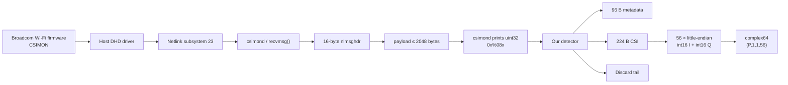
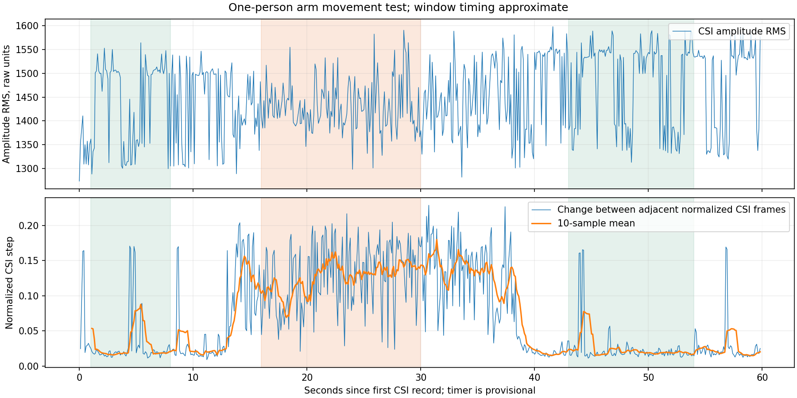

# Decoding the binary CSI dump from the ASUS ROG Rapture GT-AX11000

## Executive summary

The supplied dump and `csimond` binary allow **the CSI data itself to be recovered with high confidence**, although the full semantic names of some proprietary Broadcom fields in the 96-byte header remain unknown without firmware source code.

Main result:

> **In this particular dump, one meaningful CSI record occupies 320 bytes, not 2048 bytes.**
>
> ```text
> 0x000 .. 0x05f    96 bytes     metadata/header
> 0x060 .. 0x13f   224 bytes     CSI = 56 × (int16 I + int16 Q)
> 0x140 .. 0x7ff  1728 bytes     not CSI; repeated/stale tail
> ```
>
> Decoding CSI:
>
> ```python
> vals = np.frombuffer(record[0x60:0x140], dtype="<i2")
> csi = vals[0::2] + 1j * vals[1::2]
> ```
>
> For the supplied file:
>
> ```text
> packets     = 16
> cores       = 1
> streams     = 1
> subcarriers = 56
>
> csi.shape = (16, 1, 1, 56)
> csi.dtype = complex64
> ```

The `int8`, `uint8`, big-endian `int16`, packed 10/12-bit, and 256/512/1024-complex-value hypotheses are therefore **rejected for this dump**. The best representation, and effectively the only one consistent with the size, is **little-endian signed `int16`, interleaved `I,Q`, one complex value per 32-bit word**. The specific assignment of the first `int16` to I and the second to Q cannot be mathematically proven without a firmware structure definition or reference signal: swapping I/Q preserves amplitude. The current decoder therefore adopts `I,Q` as a working hypothesis; swapping the components remains a separate research option. By convention and by analogy with other Broadcom CSI extractors, `I,Q` is the default. Nexmon also uses interleaved `int16 real/int16 imaginary` for some Broadcom generations, although BCM4358/4366 used a different packed floating-point format, so blindly applying the Nexmon format to BCM43684 would be a mistake.

A particularly important finding is that **2048 bytes in `csimond` output do not mean 2048 bytes of useful CSI**. The supplied `csimond` accepts a `record size` in the range 0–64, and disassembly shows this value being multiplied by 32; 64 therefore produces 2048. The program allocates `0x810 = 2064` bytes, exactly `16 + 2048`, consistent with a 16-byte Linux Netlink header plus a fixed maximum payload. It then simply prints the received buffer as 32-bit words. The binary's strings explicitly include `recvmsg`, `CSI record:`, `%08x`, `record size: 0-64`, and a reference to the netlink subsystem. See the [csimond strings](../evidence/csimond-strings.txt) and [disassembly](../evidence/csimond-disasm.txt).

In the dump, the first 15 records contain 2048 printed bytes; the sixteenth is truncated after the start of the useful region, but its CSI can still be read in full. In words `24..79`, exactly `0x60..0x13f`, **every 32-bit position changes between packets**. Starting at word 80 (`0x140`), the pattern changes abruptly: each position has only two possible values, and the entire tail of the first 15 complete records literally alternates between two unchanged SHA-256 hashes:

```text
packet  0 -> 3be34b98ba96...
packet  1 -> 6cc01b9f5d98...
packet  2 -> 3be34b98ba96...
packet  3 -> 6cc01b9f5d98...
...
packet 14 -> 3be34b98ba96...
```

This effectively rules out interpreting `0x140..0x7ff` as independent CSI samples from each packet. Double buffering or a stale region of the producer buffer is a likely explanation, but the specific origin of the two pages cannot be proven from a single userspace dump. Broadcom platforms of the same generation do have a dedicated `CSIMON` HME user and pass CSIMON to the host through netlink; Broadcom platform boot logs exist that show `HMEUSR ... CSIMON`, netlink creation, and `HOST CSIMON[1.1.0]` together.

Available artifacts:

[Current decoder source](../src/decoder.py)

Raw records are preserved in the [ASUS capture](../evidence/asus-csi-probe.txt); a separate `.npy` file is not included in the repository.

The motion plot is saved as a [PNG](../evidence/clean-motion-analysis.png).

The phase plot from the original research is not included separately; the original coefficients are available in the capture above.

## What the stock ASUS/Broadcom CSIMON actually does

The GT-AX11000 is a tri-band Wi-Fi 6 router; ASUS officially specifies 4×4 Tx/Rx for 2.4 GHz and both 5 GHz radios, with support for 20/40/80/160 MHz. Hardware analyses of this model identify the radio SoC as Broadcom BCM43684.

This matters, but **a 4×4-capable radio does not mean that a single `csimond` record necessarily contains a 4×4 matrix**. The supplied record physically contains only one contiguous array of 56 complex coefficients. There are no 4×56, 16×56, or other larger sets of fresh data.

The `wl help` output extracted from the ASUS includes the stock command:

```text
wl csimon [...]
```

with operations to add/remove a monitored peer and a timer. This is the built-in Broadcom/ASUS CSI Monitor facility, not a Nexmon patch. [`wl help` output](../evidence/asus-wl-help.txt)

The supplied `csimond` itself barely acts as a decoder. Its strings and ARM disassembly reveal the following flow. [`csimond` disassembly](../evidence/csimond-disasm.txt) [`csimond` strings](../evidence/csimond-strings.txt)



The binary contains:

```text
recvmsg

Correct format:
csimond [<nl id>][<record size: 0-64>]
        [<message frequency: 1-100000 records>]

CSIMOND application started with record size %u
and message frequency %u using nl subsystem %d

CSI record:
0x%08x
```

[`csimond` strings](../evidence/csimond-strings.txt)

The disassembly shows:

```asm
lsl r1, r5, #5
```

This multiplies the user-supplied size unit by `2^5 = 32`. At the maximum of 64:

\[
64 \times 32 = 2048\ {\rm bytes}.
\]

Then:

```asm
mov r0, #0x810
bl  malloc
...
bl  recvmsg
```

where

\[
0x810=2064=16+2048.
\]

[`csimond` disassembly](../evidence/csimond-disasm.txt)

This is consistent with `csimond` receiving an entire Netlink message, skipping the header when printing, and outputting the payload as native 32-bit words. Therefore, **2048 in the startup message is a dumper parameter, not a proven size of the CSI PHY vector**.

Independent Broadcom platform boot logs show the same mechanism: a dedicated `CSIMON` HME user, netlink creation, and the `HOST CSIMON[1.1.0]` message. This agrees well with the architecture reconstructed from the supplied binary.

## Reconstructed binary record format

Across all sixteen records, the most reliable structure is as follows. Offsets refer **to the payload after the Linux `nlmsghdr`**, specifically the bytes that `csimond` displays after `CSI record:`. The original dump confirms the consistency and variability of these fields. [Raw ASUS capture](../evidence/asus-csi-probe.txt)

| Offset | Size | Proposed type | Observed content | Confidence |
|---:|---:|---|---|---|
| `0x00` | 4 | `<u32` | always `0` | high |
| `0x04` | 6 | `uint8[6]` | `a0:36:bc:9b:bf:89` | high for MAC structure |
| `0x0A` | 6 | `uint8[6]` | `3c:7c:3f:85:8a:c0` | high for MAC structure |
| `0x10` | 4 | bitfield / `<u32` | `0x04041004` | field type unknown |
| `0x14` | 4 | `<u32` | increases monotonically by approximately 500000 | very likely a timer/timestamp |
| `0x18` | 4 | `<u32` | `0xa6d82192` in this sample | unknown |
| `0x1C` | 4 | `int8[4]` | e.g. `[-56,-52,-51,-66]` | likely per-chain RSSI/PHY levels |
| `0x20` | 32 | — | zeros throughout the sample | padding/reserved |
| `0x40` | 4 | `<u32` | `0x10600021` | PHY/flags, not established precisely |
| `0x44` | 4 | bitfield / `<u32` | `0x4b83`…`0x4f03` | likely rate/rx-status |
| `0x48` | 4 | `<u32` | `0` | reserved/unknown |
| `0x4C` | 4 | `<u32` | `0x01000002` | unknown |
| `0x50` | 4 | `<u32` | `0` | unknown |
| `0x54` | 4 | `<u32` | `0` | unknown |
| `0x58` | 4 | `<u32` | `0x80000000` | flags/unknown |
| `0x5C` | 4 | `<u32` | `3` | enum/count/unknown |
| **`0x60`** | **224** | **`56 × {<i2 I,<i2 Q}`** | **CSI** | **very high** |
| **`0x140`** | up to `0x800` | — | **stale/repeated tail** | **very high: discard** |

There is unusually strong additional evidence for the two 6-byte regions: both look like normal MAC addresses, and their first three bytes are ASUS OUIs. However, without knowing which MAC the user supplied to `wl csimon`, I do not label them definitively as `source` and `BSSID`: the code deliberately calls them `mac_a` and `mac_b`. The presence of two MAC-like fields in the unchanging part of the header is virtually certain. Original header of the first packet: [raw ASUS capture](../evidence/asus-csi-probe.txt)

```text
0000: 00 00 00 00  a0 36 bc 9b  bf 89 3c 7c  3f 85 8a c0
0010: 04 10 04 04  a4 c3 df a6  92 21 d8 a6  c8 cc cd be
0020: 00 00 00 00  00 00 00 00  00 00 00 00  00 00 00 00
0030: 00 00 00 00  00 00 00 00  00 00 00 00  00 00 00 00
0040: 21 00 60 10  03 4e 00 00  00 00 00 00  02 00 00 01
0050: 00 00 00 00  00 00 00 00  00 00 00 80  03 00 00 00
0060: ac f6 54 fe  c4 fd 8f 00  40 05 d3 00  e7 04 2b 00
...
```

Field `0x14` is particularly interesting. The sequence from the first 15 complete records:

```text
0xa6dfc3a4
0xa6e774ae
0xa6ef0bc8
0xa6f6a73c
...
0xa74aa0c3
```

Differences:

```text
504074
497434
498548
500730
499311
500019
500328
500166
499858
499721
500632
499407
500021
503174
```

Mean:

```text
500244.5
```

This strongly resembles a time counter with increments of about 500 ms and a unit of approximately one microsecond, consistent with the periodic `wl csimon ... <timer ms>` mode present in ASUS `wl` help. Without the Broadcom structure definition, however, I retain **`timer_0x14` / timestamp candidate** rather than presenting a guess as the exact field name. See the [`wl help` output](../evidence/asus-wl-help.txt) and [raw capture](../evidence/asus-csi-probe.txt).

### Why the boundary is exactly `0x60..0x140`

Counting unique values at each 32-bit position across the first 15 complete records produces a distinctive pattern:

```text
header:
 word  5   changes      <- timer
 word  7   changes      <- four signed bytes
 word 17   changes      <- status/flags

CSI:
 words 24..79:
   every one changes packet-to-packet

tail:
 words 80..511:
   exactly 2 unique values at EVERY position
```

Thus:

\[
24\cdot4=96=0x60
\]

and

\[
80\cdot4=320=0x140.
\]

The length of the fresh region is:

\[
320-96=224\ {\rm bytes}.
\]

An even stronger match appears here:

\[
224/(2+2)=56
\]

complex samples, if each consists of two signed `int16` values.

Not a single padding byte is needed between them.

## Why the format is little-endian signed int16 I/Q

The first CSI word printed by `csimond` is:

```text
0xfe54f6ac
```

[Raw ASUS capture](../evidence/asus-csi-probe.txt)

Avoid the common mistake of treating the character order in `%08x` as the byte order in memory. The `csimond` binary is little-endian ARM, and the program reads data using a native 32-bit load before printing the number with `%08x`. Therefore, memory contains:

```text
ac f6 54 fe
```

Interpreted as `<i2,<i2`, this is:

```text
I = 0xf6ac = -2388
Q = 0xfe54 =  -428
```

The first CSI vector does indeed begin:

```text
[-2388-428j,
  -572+143j,
  1344+211j,
  1255 +43j,
 -2329+783j,
 -1175-391j,
  1458-449j,
   568-580j,
 ...]
```

### Comparing alternatives

| Hypothesis | Result | Verdict |
|---|---|---|
| **LE signed int16 I/Q** | **56 complex values; σI≈1017.5, σQ≈1030.5; ranges symmetric about 0** | **accepted** |
| BE signed int16 I/Q | 56 complex values, but ~69% of components have `|x| > 10000`, typical scale ≈25k | extremely unlikely |
| LE uint16 | constant positive offset for negative coefficients | rejected |
| int8 I/Q | 112 complex values; `σ≈74.7` for one component and only `≈4.0` for the other | clearly shows low/high bytes of `int16`; rejected |
| packed 10+10 bit | `1792/20 = 89.6` complex values | impossible without additional nonlocal padding |
| packed 12+12 bit | `1792/24 = 74.67` complex values | impossible |
| packed 16+16 bit | `1792/32 = 56` complex values | **exact match** |
| compressed stream | no framing/length/codebook indicators; every four bytes directly yield a plausible complex value | unnecessary |
| 256 tones | would require at least 1024 CSI bytes | no fresh data available |
| 512 tones | 2048 CSI bytes without a header | contradicts the 96-B header and stale tail |
| 1024 tones | at least 4096 bytes with int16 IQ | physically does not fit |

The most revealing test against `int8`: decoding the same 224 bytes as `int8 I,Q` gives a standard deviation of about `74.7` for one channel and only `4.0` for the other. This is exactly what is expected when signed `int16` values are split incorrectly: the low byte looks like an almost random 8-bit number, while the high byte mainly represents the sign and a few upper bits of a small `int16`.

With the correct `int16` interpretation:

```text
I:
    min   -2969
    max    3164
    mean     -6.83
    std    1017.51

Q:
    min   -3429
    max    2824
    mean    -66.57
    std    1030.45
```

I and Q therefore have almost identical scales and are centered around zero, as expected for two signed quadrature components.

### Why 56, rather than 256/512/1024

It is necessary to distinguish **FFT size**, **the number of active OFDM tones**, and **the number of CSI coefficients the vendor driver chooses to export**.

Classic 20 MHz 802.11n uses 64 FFT bins, of which 56 carry data and pilots; CSI implementations may export all FFT bins, only the active portion, or an even sparser selection. Research literature on 802.11n explicitly describes 56 used subcarriers at 20 MHz.

Nexmon, by contrast, deliberately exports **all** 64 bins for 20 MHz, 128 for 40 MHz, and 256 for 80 MHz, including guard/null bins. Its documentation specifically warns that null/guard values may be arbitrary. This is why the Nexmon wire format cannot be assumed identical to stock Broadcom CSIMON.

The GT-AX11000 supports 802.11ax and is also backward compatible with 802.11a/b/g/n/ac. The presence of 56 values therefore **does not mean the router is not AX**: it means that the size of this particular exported CSI record matches a 20-MHz legacy/HT-style active-tone vector or a vendor representation of 56 selected tones. A single dump cannot prove which PHY PPDU produced these coefficients.

In other words, the original hypothesis that AX necessarily requires looking for 256/512/1024 values is not supported by this file.

### I/Q versus Q/I

For a single unknown channel, swapping

\[
H=I+jQ
\]

for

\[
H'=Q+jI
\]

cannot be detected from the amplitude distribution:

\[
|H|=|H'|.
\]

Likewise, complex conjugation

\[
H^*=I-jQ
\]

does not change the amplitude.

The most defensible classification is therefore:

```text
endianness       little-endian            very well supported
component width  signed int16             very well supported
interleaving     two int16 per complex    very well supported
I before Q       default/convention       likely, but not mathematically proven
phase sign       hardware convention      requires a reference measurement
fixed-point Qn   unknown                  absolute scale not established
```

Raw scale is often sufficient for amplitude/sensing tasks. Absolute physical calibration of the channel requires firmware scaling/AGC to be established separately.

## Decoder and automatic format detection

The current implementation is [src/decoder.py](../src/decoder.py). It uses
only the Python standard library and returns a dictionary for each record containing
metadata, `I/Q` pairs, and amplitudes. This decoder is specific to captures in the
observed GT-AX11000 format; it is not a universal Broadcom decoder.

Minimal usage example:

```python
from pathlib import Path
import sys
sys.path.insert(0, "src")
from decoder import decode, text_records

records = list(text_records(Path("evidence/asus-csi-probe.txt").read_text()))
decoded = [decode(record) for record in records]
print(len(decoded), len(decoded[0]["iq"]))  # 16, 56
```

Actual output for the supplied file:

```text
Layout(
    container_stride=None,
    netlink_header=0,
    header_len=96,
    csi_end=320,
    subcarriers=56,
    cores=1,
    streams=1,
    endian='<',
    iq_order='iq',
    confidence='high'
)

csi.shape: (16, 1, 1, 56)
csi.dtype: complex64

mac_a: a0:36:bc:9b:bf:89
mac_b: 3c:7c:3f:85:8a:c0

timer[0:4]:
[2799682468, 2800186542, 2800683976, 2801182524]

rssi_like[0]:
[-56, -52, -51, -66]
```

The core decoder is ultimately very simple:

```python
import numpy as np

def decode_one(record: bytes) -> np.ndarray:
    payload = record[0x60:0x140]

    # 224 B / 2 B = 112 int16
    x = np.frombuffer(payload, dtype="<i2")

    # 112 int16 / 2 = 56 complex coefficients
    i = x[0::2].astype(np.float32)
    q = x[1::2].astype(np.float32)

    return (i + 1j*q).astype(np.complex64)
```

Assembling the required dimensions:

```python
vectors = [decode_one(record) for record in records]

csi = np.stack(vectors, axis=0)
csi = csi[:, None, None, :]

assert csi.shape == (len(records), 1, 1, 56)
```

### How the research confirmed the CSI boundaries

The current decoder checks profile `0x04041004` and uses
the `0x60:0x140` region established for this capture. The automatic boundary
search, plots, and NumPy calculations below belong to the research
analysis; they are retained as a description of the method, not as the repository API.

The research analysis used the following algorithm for four or more records
(it is not a separate API in the current repository):

```text
1. Parse csimond text:
      CSI record:
      0x........
      ...

2. Reconstruct native LE bytes from each uint32.

3. For each 32-bit position, count:
      unique values across packets.

4. Find a long contiguous region
   that changes in almost every packet.

5. For this file, automatically obtain:
      start word = 24
      end word   = 80

6. Calculate:
      start = 24*4 = 96
      end   = 80*4 = 320
      size  = 224 bytes

7. Try standard candidate tone counts.

8. 224/4 = 56 complex values — an exact match.

9. Return:
      (packets, 1, 1, 56)
```

The logic in pseudocode:

```python
uniq[j] = number_of_unique_values(records[:, j])

fresh[j] = uniq[j] >= threshold

start, end = longest_contiguous_run(fresh)

# supplied dump:
# start=24, end=80

csi_bytes = (end-start)*4
complex_count = csi_bytes // 4

# 224 // 4 = 56
```

This is considerably more reliable than merely finding a convenient number, because the `0x140` boundary is detected **before** interpreting I/Q: it follows directly from variability between packets.

### Containers considered in the research

The original research decoder considered the following input variants:

```text
csimond textual dump
    CSI record:
    0x12345678 ...

raw payload records × 2048 B

raw netlink receive buffers × 2064 B
    16 B nlmsghdr
    up to 2048 B payload

already trimmed records × 320 B
```

For raw netlink, the research accounted for:

```python
struct nlmsghdr:
    uint32 nlmsg_len
    uint16 nlmsg_type
    uint16 nlmsg_flags
    uint32 nlmsg_seq
    uint32 nlmsg_pid
```

Thus, CSI offset `0x60` refers to the **CSIMON payload**. When decoding a saved Netlink message in full, the corresponding physical offset is:

\[
0x10+0x60=0x70.
\]

### Cores and streams

The decoder deliberately avoids inventing data that is not present.

Although each GT-AX11000 radio is 4×4, the supplied fresh region contains:

\[
56\times4=224\ {\rm bytes},
\]

which is exactly **one** CSI vector of 56 complex numbers. ASUS confirms hardware support for 4×4, but that is only a radio capability.

The correct result for this file is therefore:

```text
cores   = 1
streams = 1

shape = (16, 1, 1, 56)
```

rather than an artificially constructed:

```text
(16, 4, 4, 56)
```

which would require:

\[
4\times4\times56\times4=3584
\]

bytes of CSI per packet.

In Nexmon, core/stream are indeed separate CSI extraction parameters encoded in its packet header, but stock CSIMON has a different wire format.

One might suspect that a field at `0x10`, `0x40`, `0x44`, or `0x5c` encodes core/PHY state; however, this sample has no controlled core/stream variation that would allow the bits to be assigned experimentally. The script therefore preserves only the established dimensions.

## Validation, statistics, and plots

Across all:

\[
16\times56=896
\]

complex CSI coefficients, the following statistics were obtained:

| Metric | Value |
|---|---:|
| `I min` | `-2969` |
| `I max` | `3164` |
| `I mean` | `-6.833` |
| `I std` | `1017.51` |
| `Q min` | `-3429` |
| `Q max` | `2824` |
| `Q mean` | `-66.57` |
| `Q std` | `1030.45` |
| `|H| min` | `58.60` |
| `|H| median` | `1237.53` |
| `|H| mean` | `1291.38` |
| `|H| p95` | `2447.39` |
| `|H| max` | `3447.88` |

These values were computed directly from the supplied dump using the described `<i2 I,Q` decoder. [Raw ASUS capture](../evidence/asus-csi-probe.txt)

The first eight complex coefficients of the first packet:

```python
array([
    -2388.-428.j,
     -572.+143.j,
     1344.+211.j,
     1255. +43.j,
    -2329.+783.j,
    -1175.-391.j,
     1458.-449.j,
      568.-580.j
], dtype=complex64)
```

Amplitude is computed in the standard way:

```python
amplitude = np.abs(csi)
```

and phase:

```python
phase = np.angle(csi)
```

For a continuous view of phase across tones:

```python
phase_unwrapped = np.unwrap(np.angle(csi), axis=-1)
```

### Amplitude of several packets



[PNG of amplitude and motion plot](../evidence/clean-motion-analysis.png)

The X-axis index here is **the ordinal index of one of the 56 exported tones**, not yet a guaranteed IEEE subcarrier number `k`. Converting `0..55` into, for example, `-28..-1,+1..+28` requires confirmation of whether Broadcom retains pilots and which bin order stock CSIMON uses. The number 56 itself agrees well with a 20-MHz active-tone representation, but the order cannot yet be inferred from the userspace dump. Research CSI implementations also differ in whether they return all FFT bins or only the used carriers.

### Phase of several packets

A separate phase plot is not included in this repository; the amplitude and motion plot is preserved ([PNG](../evidence/clean-motion-analysis.png)).

The plot uses `np.unwrap` so that `+π → -π` wraps do not look like physical channel jumps.

When using CSI for sensing, raw phase should still not be treated directly as absolute propagation phase: packet detection delay, carrier/sampling frequency offsets, and other RX synchronization effects in ordinary Wi-Fi CSI measurements introduce packet-dependent phase offsets/slopes. This is a known problem in the CSI measurement literature.

### Stale-tail test

In my view, this is the most important validation test, because without it nearly the entire 2048-byte block could easily be mistaken for CSI.

For each complete packet:

```python
tail = record[0x140:0x800]
sha256(tail)
```

produces:

```text
packet  0  3be34b98ba96...
packet  1  6cc01b9f5d98...
packet  2  3be34b98ba96...
packet  3  6cc01b9f5d98...
packet  4  3be34b98ba96...
packet  5  6cc01b9f5d98...
...
packet 14  3be34b98ba96...
```

Meanwhile, **the actual `0x60..0x13f` region is unique for each packet**. Such strict A/B/A/B repetition of the large tail is incompatible with the idea that it contains hundreds of fresh CSI bins for every received Wi-Fi frame. [Raw ASUS capture](../evidence/asus-csi-probe.txt)

Thus, the old approach:

```python
# INCORRECT
x = np.frombuffer(record, dtype="<i2")
```

or:

```python
# ALSO INCORRECT
x = np.frombuffer(record[96:], dtype="<i2")
```

contaminates the CSI almost entirely with stale data.

Correct:

```python
x = np.frombuffer(record[0x60:0x140], dtype="<i2")
```

## Alternative interpretations, limitations, and usage

Four things cannot honestly be considered fully proven from the available file.

**Semantic I/Q ordering.** The numerical format clearly looks like two signed 16-bit components. However, `(I,Q)` cannot be distinguished from `(Q,I)` using only an unknown channel. The current decoder adopts `I,Q` as a working hypothesis; swapping them can be investigated through a small separate analysis of the pairs in `src/decoder.py`.

A controlled RF reference or firmware structure source would allow this to be established conclusively.

**Phase sign / conjugation.** Some PHY chains use a convention equivalent to complex conjugation relative to the user's expected transfer function definition. The current standard-library decoder does not automatically construct a phase array; the choice of `H` or `H*` remains part of future NumPy analysis.

The choice between `H` and `H*` is best made using a known phase slope or comparison with SDR/reference CSI, rather than how attractive the plot looks.

**Absolute fixed-point scale.** The values clearly fit within signed `int16`, but a userspace capture cannot establish whether they represent, for example, an internal Q-format with a specific number of fractional bits or simply scaled PHY estimates. The decoder therefore preserves raw coefficients without dividing them by an invented `2^N`.

**Status field names.** The CSI boundary and type have been reconstructed far more reliably than the proprietary header. Fields `0x40/0x44/...` should be treated as unknown bitfields until either a Broadcom header definition or a series of controlled captures varying MCS/BW/core/NSS/chanspec becomes available.

### How to distinguish the remaining alternatives experimentally

The most informative next controlled test is to vary **exactly one PHY parameter per experiment**, rather than collect more of the same data:

```text
capture A: same peer, 20 MHz, fixed MCS/NSS
capture B: same peer, different MCS
capture C: 40 MHz
capture D: 80 MHz
capture E: NSS=1 / NSS=2
capture F: different RX chains/core masks
```

Then compare only the first 96 bytes.

This allows the proprietary header to be reconstructed almost mechanically:

```python
for offset in range(0, 96, 4):
    print(
        offset,
        np.unique(header_A[:, offset:offset+4], axis=0),
        np.unique(header_B[:, offset:offset+4], axis=0),
    )
```

For example, if changing `MCS 3 → MCS 7` while holding everything else fixed changes only part of `0x44`, that provides strong grounds for assigning the corresponding bits to rate/MCS. The same method works for core, NSS, and bandwidth.

Verifying the order of the 56 tones requires a frequency-selective reference, such as a known notch/interference on one side of the channel. This would establish whether the array follows:

```text
[-28 ... -1, +1 ... +28]
```

FFT order, or some internal Broadcom order.

### Running the current decoder

Run from the repository root:

```bash
python -c "from pathlib import Path; import sys; sys.path.insert(0, 'src'); from decoder import decode, text_records; r=list(text_records(Path('evidence/asus-csi-probe.txt').read_text())); print({'records': len(r), 'iq_per_record': len(decode(r[0])['iq'])})"
```

Actual result for the supplied file:

```text
layout:
  header_len=96
  csi_end=320
  subcarriers=56
  cores=1
  streams=1
  endian='<'
  confidence='high'

csi.shape: (16, 1, 1, 56)
csi.dtype: complex64
```

In the current repository, the NumPy array and plots are built by separate research
scripts in `scripts/`, which require NumPy/Matplotlib. For the test already saved,
use [scripts/analyze_clean.py](../scripts/analyze_clean.py); the result
is saved as [JSON](clean-motion-analysis.json) and [PNG](../evidence/clean-motion-analysis.png).

For custom NumPy analysis of the decoded pairs:

```python
from pathlib import Path
import sys
import numpy as np
sys.path.insert(0, "src")
from decoder import decode, text_records

records = list(text_records(Path("evidence/asus-csi-probe.txt").read_text()))
iq = [decode(record)["iq"] for record in records]
csi = np.asarray([[complex(i, q) for i, q in frame] for frame in iq], dtype=np.complex64)

print(csi.shape)
# (16, 56)

print(csi.dtype)
# complex64

H = csi

amplitude = np.abs(H)
phase = np.angle(H)
phase_unwrapped = np.unwrap(phase, axis=-1)

print(amplitude.shape)
# (16, 56)

print(phase.shape)
# (16, 56)
```

Switching to `complex128` adds no information to the original `int16` values, but may be convenient for subsequent numerical processing.

## External references

- [Official ASUS ROG Rapture GT-AX11000 specifications](https://rog.asus.com/us/networking/rog-rapture-gt-ax11000-model/spec/)
- [Nexmon CSI — a separate Broadcom CSI project](https://github.com/seemoo-lab/nexmon_csi)
- [RuView upstream](https://github.com/ruvnet/RuView)

### Overall confidence levels

| Conclusion | Confidence |
|---|---|
| `csimond` works through Netlink | **very high** |
| Maximum printed payload = 2048 B | **very high** |
| 2048 B is not the size of useful CSI | **very high** |
| Header = `0x60 = 96 B` | **very high** |
| CSI end = `0x140 = 320 B` | **very high** |
| CSI payload = `224 B` | **very high** |
| 56 complex coefficients | **very high** |
| signed `int16` components | **very high** |
| little-endian | **very high** |
| two interleaved components | **very high** |
| default `I,Q` rather than `Q,I` | **medium/high, but not provable from a single channel** |
| absolute fixed-point scale | **not established** |
| do not use tail `0x140..` as CSI | **very high** |
| tail is related to two producer/HME buffers | **plausible hypothesis, not proven** |
| `0x14` is a µs-like timer/timestamp | **high-confidence hypothesis** |
| `0x1c` contains four RSSI-like values | **medium/high-confidence hypothesis** |
| exact semantics of `0x40/0x44` | **still unknown** |
| this record contains a 4×4 CSI matrix | **no; contradicted by its size** |
| practical output shape | **`(16,1,1,56)`** |

Thus, the immediate task of **converting this dump into complex CSI is solved**: the useful coefficients are in `record[0x60:0x140]` and decode as `<i2 I, <i2 Q`, yielding 56 complex values per record. The most significant correction to the original hypothesis is to avoid interpreting all 2048 bytes as PHY CSI or looking for 256/512/1024 tones in this particular file. Here, 2048 is the size of the `csimond` output; the actual dynamic CSI region is only 224 bytes. The supporting evidence is preserved in the [`csimond` strings](../evidence/csimond-strings.txt), [disassembly](../evidence/csimond-disasm.txt), and [raw capture](../evidence/asus-csi-probe.txt).
